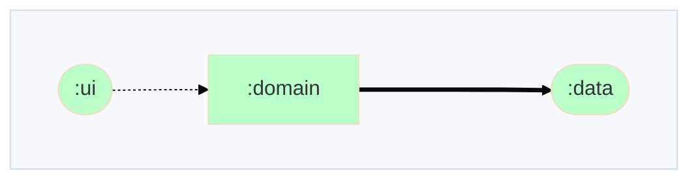

```mermaid
%%{ init: { 'theme': 'base' } }%%
graph LR;

%% Styling for module nodes by type
classDef rootNode stroke-width:4px;
classDef mppNode fill:#ffd2b3,color:#333333;
classDef andNode fill:#baffc9,color:#333333;
classDef javaNode fill:#ffb3ba,color:#333333;

%% Modules
subgraph  
  direction LR;
  :data([:data]):::andNode;
  :domain[:domain]:::andNode;
  :ui([:ui]):::andNode;
end

%% Dependencies
:domain===>:data

%% Dependents
:ui-.->:domain
```